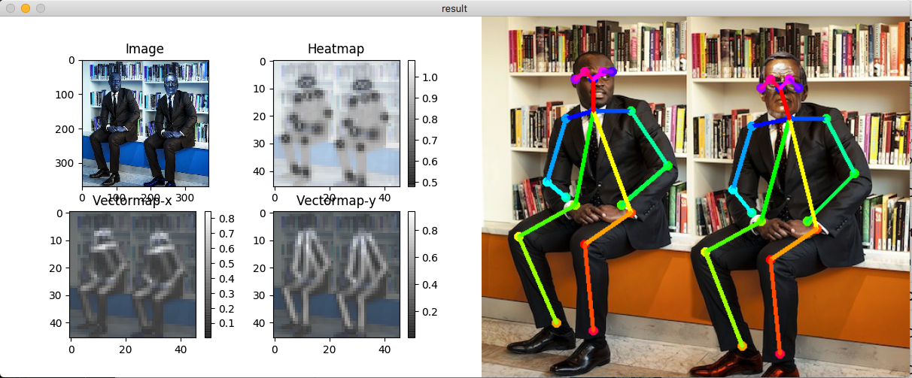

# tf-pose-estimation

'Openpose', human pose estimation algorithm, have been implemented using Tensorflow. It also provides several variants that have some changes to the network structure for **real-time processing on the CPU or low-power embedded devices.**

**You can even run this on your macbook with a descent FPS!**

Original Repo(Caffe) : https://github.com/CMU-Perceptual-Computing-Lab/openpose

Implemented features are listed here : [features](./etcs/feature.md)

## Install

### Dependencies

You need dependencies below.

- python3
- tensorflow 1.4.1+
- opencv3, protobuf, python3-tk
- slidingwindow

### Install

Clone the repo and install 3rd-party libraries.

```bash
$ git clone https://www.github.com/ildoonet/tf-pose-estimation
$ cd tf-pose-estimation
$ pip3 install -r requirements.txt
```

Build c++ library for post processing. See : https://github.com/ildoonet/tf-pose-estimation/tree/master/tf_pose/pafprocess
```
$ cd tf_pose/pafprocess
$ swig -python -c++ pafprocess.i && python3 setup.py build_ext --inplace
```

### Package Install

Alternatively, you can install this repo as a shared package using pip.

```bash
$ git clone https://github.com/sesha-codeprism/PoseEstimation
$ cd tf-openpose
$ python setup.py install
```

### Download Tensorflow Graph File(pb file)

Before running demo, you should download graph files. You can deploy this graph on your mobile or other platforms.

- cmu (trained in 656x368)
- mobilenet_thin (trained in 432x368)
- mobilenet_v2_large (trained in 432x368)
- mobilenet_v2_small (trained in 432x368)

CMU's model graphs are too large for git, so I uploaded them on an external cloud. You should download them if you want to use cmu's original model. Download scripts are provided in the model folder.

```
$ cd models/graph/cmu
$ bash download.sh
```

## Demo

### Test Inference

You can test the inference feature with a single image.

```
$ python run.py --model=mobilenet_thin --resize=432x368 --image=./images/p1.jpg
```

The image flag MUST be relative to the src folder with no "~", i.e:
```
--image ../../Desktop
```

Then you will see the screen as below with pafmap, heatmap, result and etc.



### Realtime Webcam

```
$ python run_webcam.py --model=mobilenet_thin --resize=432x368 --camera=0
```


## Python Usage

This pose estimator provides simple python classes that you can use in your applications.

See [run.py](run.py) or [run_webcam.py](run_webcam.py) as references.

```python
e = TfPoseEstimator(get_graph_path(args.model), target_size=(w, h))
humans = e.inference(image)
image = TfPoseEstimator.draw_humans(image, humans, imgcopy=False)
```
